# Data analysis {Data science}

## Analysis of Deaths by Police in the United States
## Extract insights from combining US census data and the Washington Post's database on deaths by police in the United States.

<h3 align="center" >Deaths by Police US by gender</h3> 

<h2 align="center">
  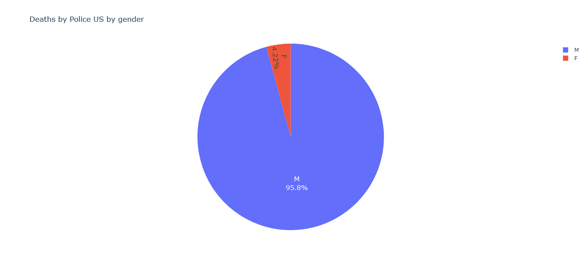
</h2>

<h3 align="center"> Deaths by Police in US by race</h3>

<h2 align="center">
  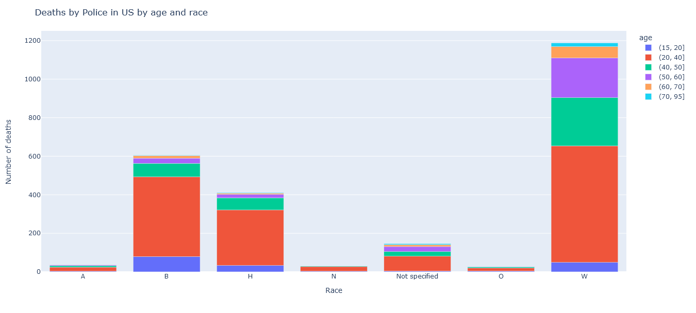
</h2>

<h3 align="center" > Deaths by Police in US by age and race</h3>

<h2 align="center">
  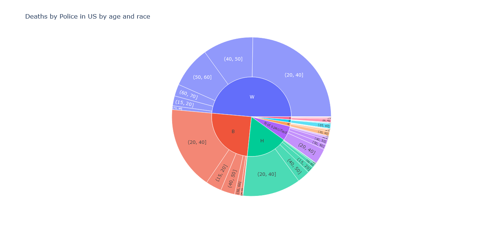
</h2>

<h3 align="center" > Deaths by Police in US by age and race</h3>

<h2 align="center">
  
</h2>

<h3 align="center" > Deaths by Police in US by state</h3>

<h2 align="center">
  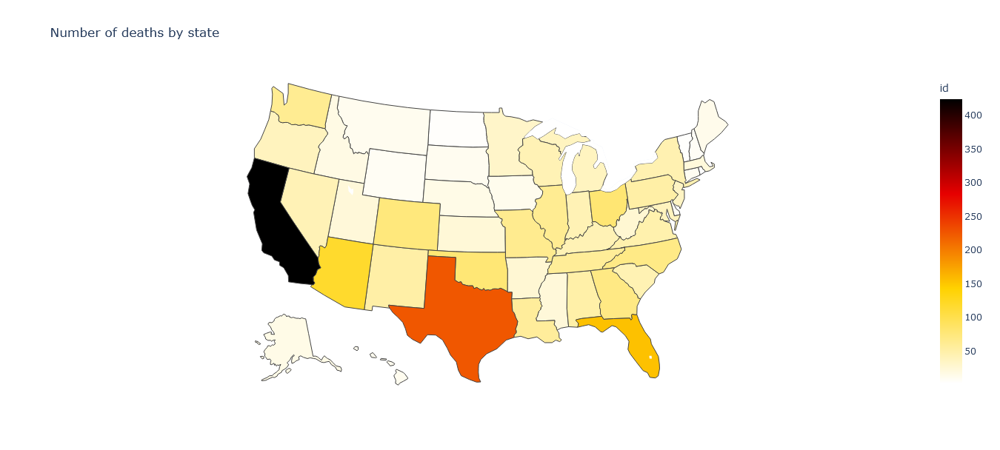
</h2>

<h3 align="center" > Number of deaths by Month </h3>

<h2 align="center">
  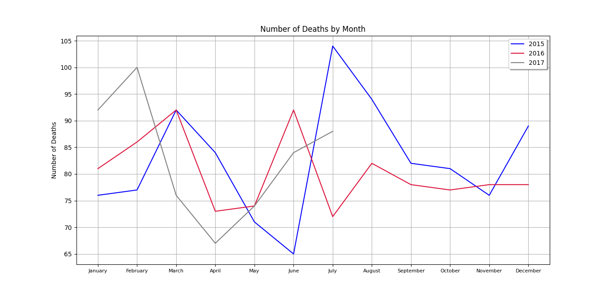
</h2>

<h3 align="center" > Type of Weapon Used </h3>

<h2 align="center">
  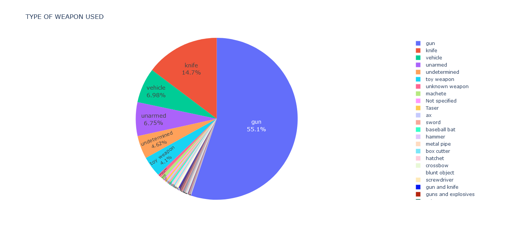
</h2>

<h3 align="center" >Flee the Scene</h3>

<h2 align="center">
  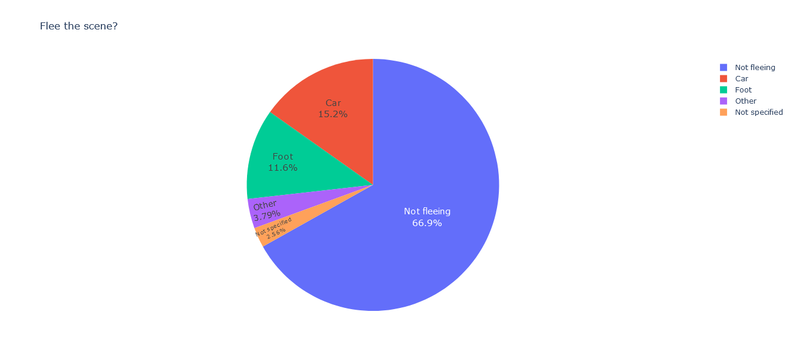
</h2>

<h3 align="center" >Signs of Mental Illness </h3>

<h2 align="center">
  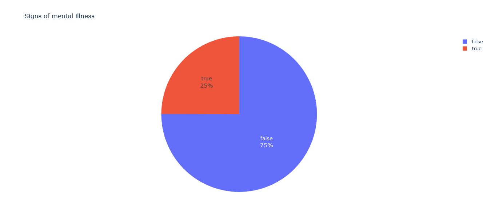
</h2>

<h3 align="center" >Threat Level</h3>

<h2 align="center">
  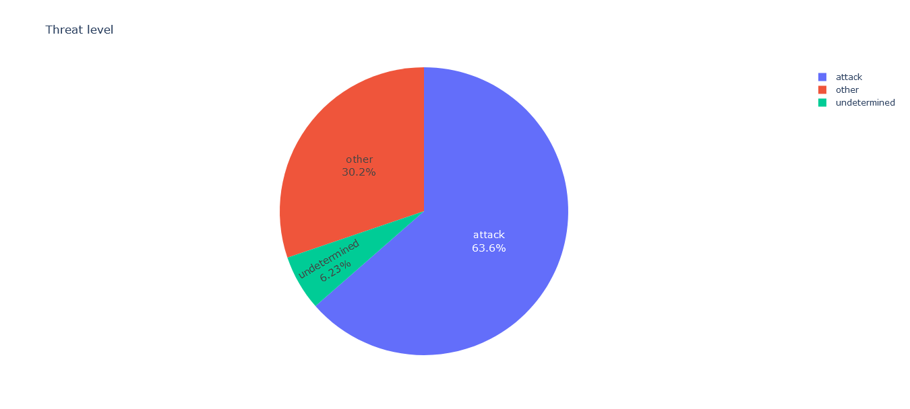
</h2>

<h3 align="center" >Use of Body Camera </h3>

<h2 align="center">
  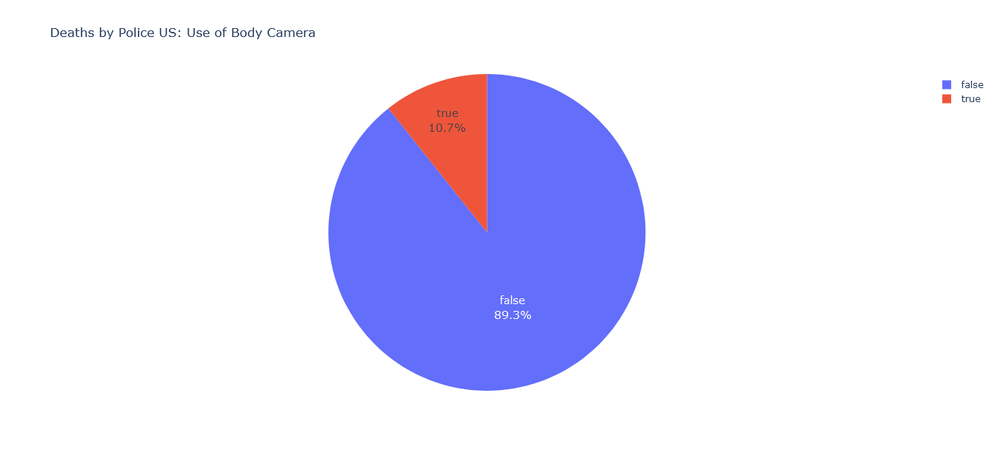
</h2>

<h1 align="center" >Analyzing different aspects by geographical area</h1> 
<h3 align="center" >Media income data</h3> 

<h2 align="center">
  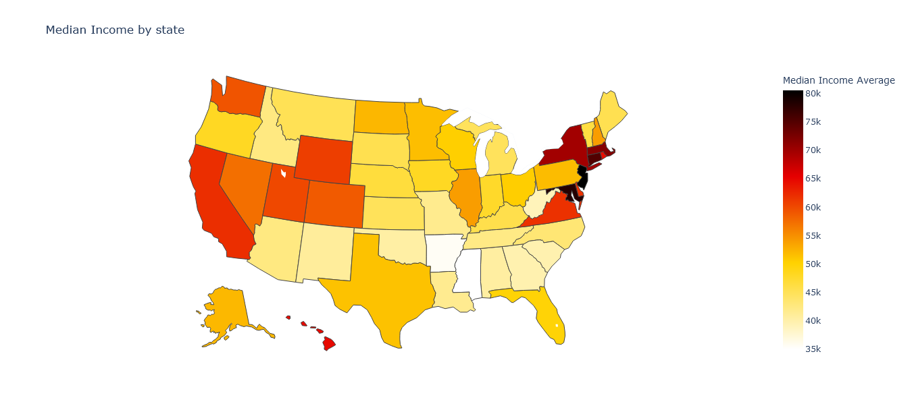
</h2>

<h3 align="center" >Percent over 25 Completed High School</h3> 

<h2 align="center">
  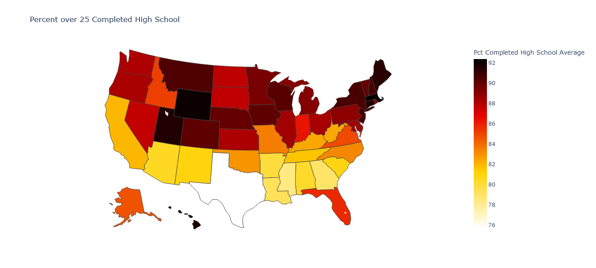
</h2>

<h3 align="center" >Percent People Below Poverty Level</h3> 

<h2 align="center">
  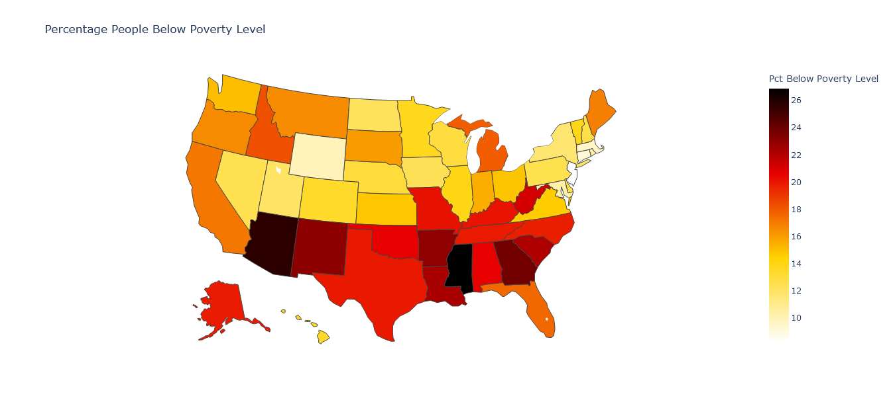
</h2>

<h1 align="center" >Share of Race by geographical area</h1>

<h3 align="center" >White Percentage by State</h3>
<h2 align="center">
  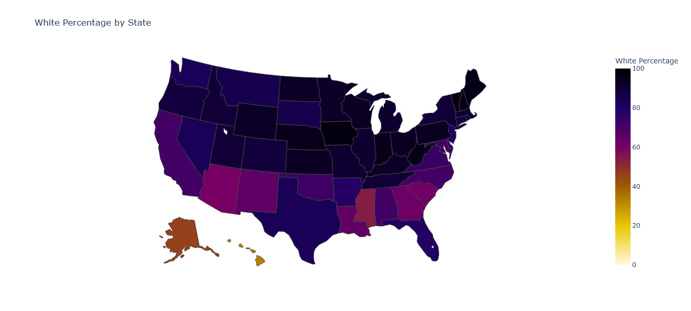
</h2>

<h3 align="center" >Black Percentage by State</h3>
<h2 align="center">
  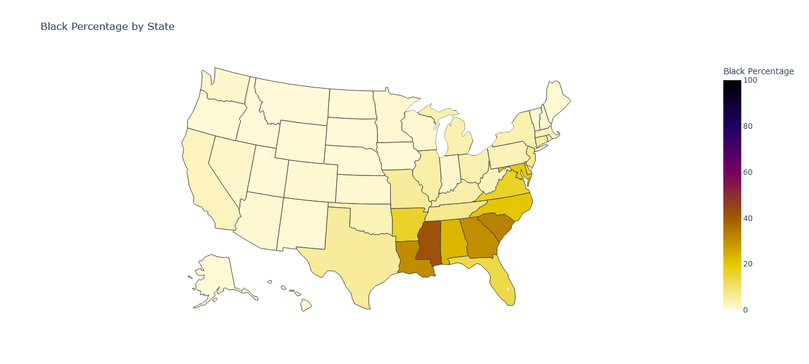
</h2>

<h3 align="center" >Hispanic Percentage by State</h3>
<h2 align="center">
  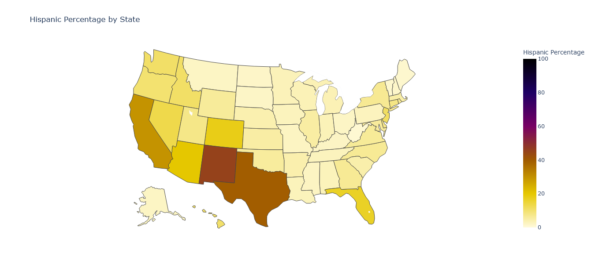
</h2>

<h3 align="center" >Native American Percentage by State</h3>
<h2 align="center">
  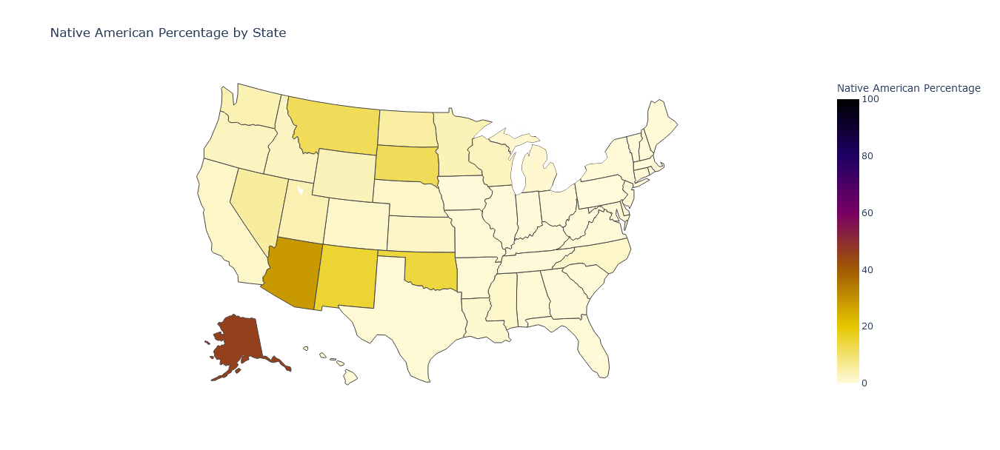
</h2>

<h3 align="center" >Asian Percentage by State</h3>
<h2 align="center">
  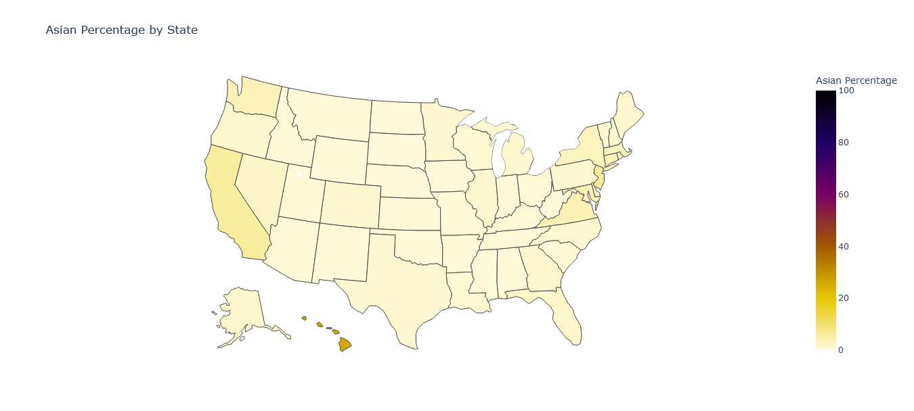
</h2>
