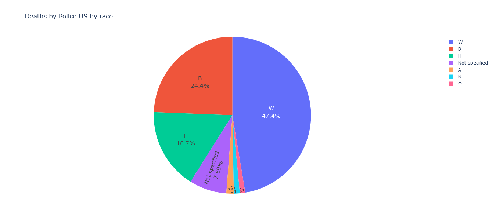

# Data analysis {Data science}
# Analysis of Deaths by Police in the United States

<p>


</p>

## Analysis of Deaths by Police in the United States
## Extract insights from combining US census data and the Washington Post's database on deaths by police in the United States.

### If you want to see the complete step by step with all the details [follow the instructions](#instructions).

### you can also check the file: [jupyter notebook](Deaths_by_Police_US.ipynb).


<h3> Let us first examine the percentage of deaths by gender. </h3>

<h3 align="center" >Deaths by Police US by gender</h3> 

<h2 align="center">
  
</h2>

<h3> What behavior can be observed by race? </h3>

<h3 align="center"> Deaths by Police in US by race</h3>

<h2 align="center">
  
</h2>

<h3> Group by age and race </h3>

<h3 align="center" > Deaths by Police in US by age and race</h3>

<h2 align="center">
  
</h2>


<h3 align="center" > Deaths by Police in US by age and race</h3>

<h2 align="center">
  
</h2>

<h3> Regardless of race, the highest percentage of deaths by age is between 20-40 years old. </h3>

<h3> Does the number of deaths increase in a specific month? </h3>

<h3 align="center" > Number of deaths by Month </h3>

<h2 align="center">
  
</h2>

<h3> There is no trend, however it could be analyzed in more detail. </h3>

<h3 align="center" > Type of Weapon Used </h3>

<h2 align="center">
  
</h2>

<h3 align="center" >Flee the Scene</h3>

<h2 align="center">
  
</h2>

<h3 align="center" >Signs of Mental Illness </h3>

<h2 align="center">
  
</h2>

<h3 align="center" >Threat Level</h3>

<h2 align="center">
  
</h2>

<h3> Was cameras used as testimony? </h3>

<h3 align="center" >Use of Body Camera </h3>

<h2 align="center">
  
</h2>

<h1 align="center" >Analyzing different aspects by geographical area</h1> 

<h3 align="center" > Deaths by Police in US by state</h3>

<h2 align="center">
  
</h2>

<h3> The state of California, followed by the state of Texas, has the highest number of deaths by police in the US. </h3>


<h3> How does the level of education influence the reduction of incidents? </h3>

<h3 align="center" >Percent over 25 Completed High School</h3> 

<h2 align="center">
  
</h2>

<h3> How does the median income level influence the reduction of incidents? </h3>

<h3 align="center" >Media income data</h3> 

<h2 align="center">
  
</h2>

<h3> Although California has one of the highest median incomes, it is the state with the highest number of deaths by police. </h3>

<h3 align="center" >Percent People Below Poverty Level</h3> 

<h2 align="center">
  
</h2>


### Instructions
1. Download the repository to your local machine and extract it into a folder:
```
https://github.com/MetaphorKaleidoscope/Data_analysis_Data_science_Deaths_by_Police_US.git
```
2. Open in your browser "Deaths_by_Police_US.html"


